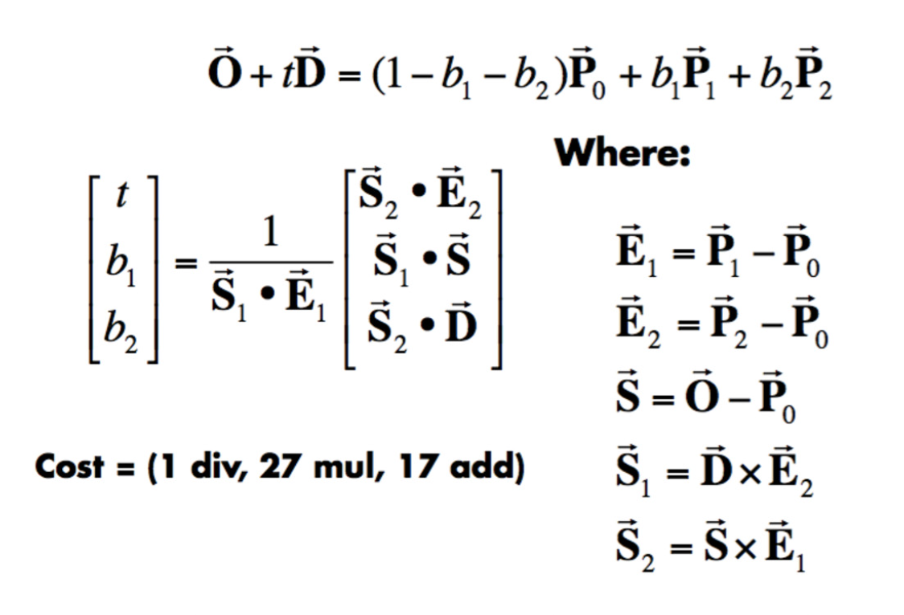
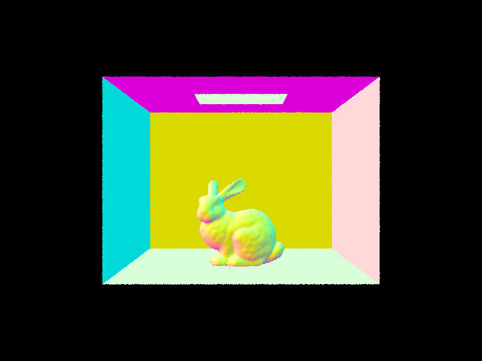
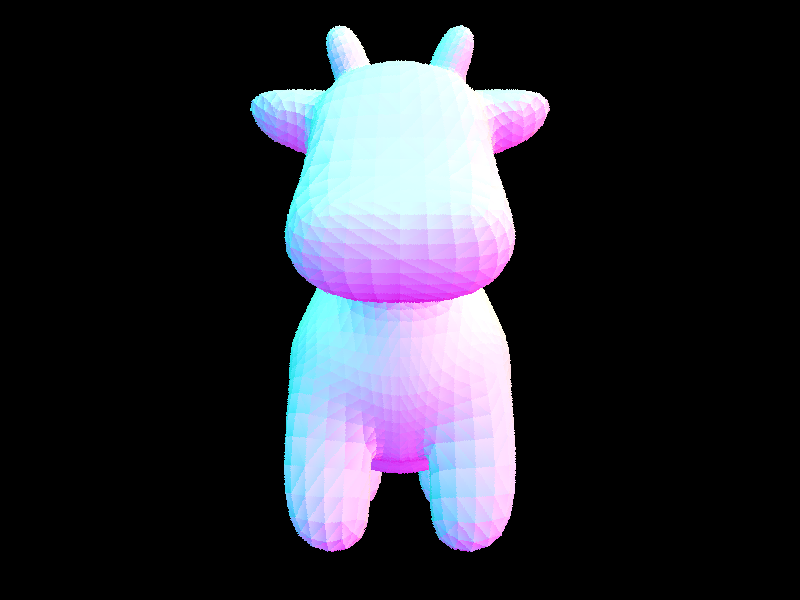
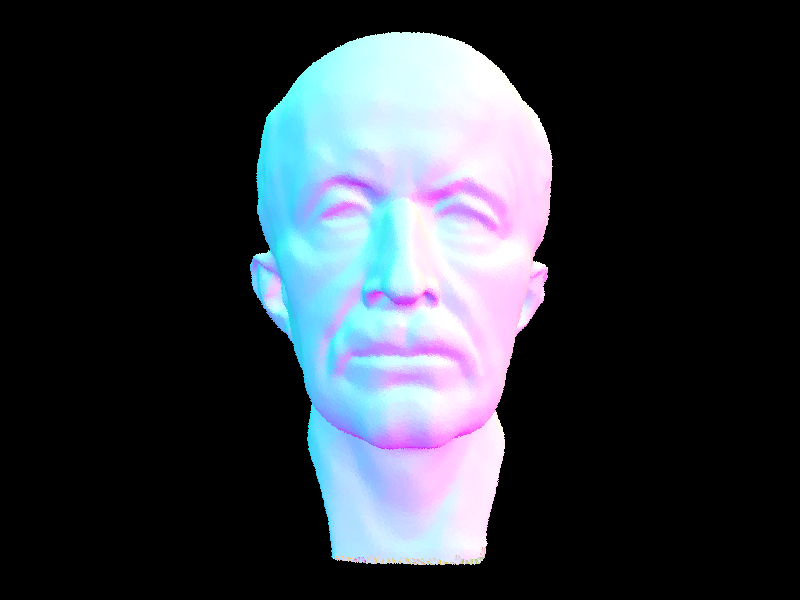
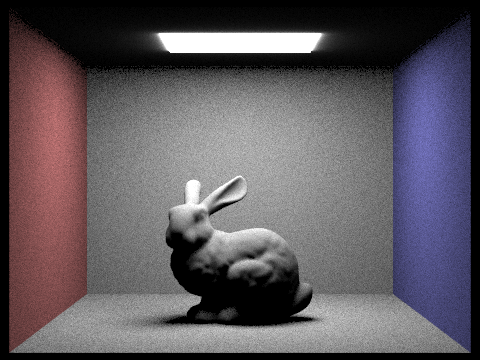
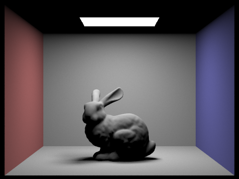
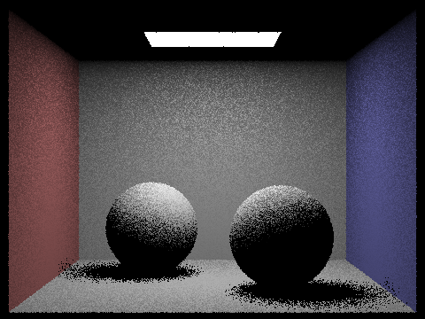
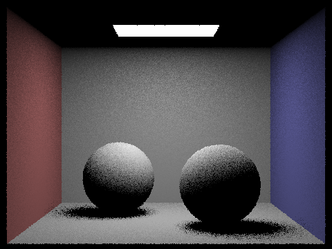
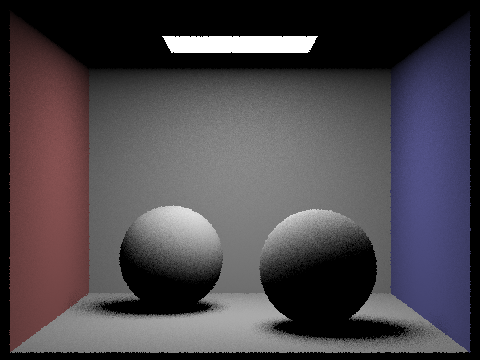

# Project 3 Part 1

Note: Image can't load well on print. Please go to my webpage to view images.
If the webpage images can't load (sometimes Github.io webpages takes a long time to load images up), please look at the images in the source code (`/img-3/` folder)

## Part 1: Ray Generation and Scene Intersection
### I. Ray generation
A ray equation is `r = o + dt` where `o` is the origin vector and `d` is the ray's direction vector. 

<!--  -->

We start out with a view from the image space. We then want to convert from image space to camera space, which involves mathematics to figure out the image locations within the world relations (3D). Given `hFov` and `vFov` of the camera in degrees the camera space ray's direction will be:

`dir = [(x-0.5)*2*tan(radians(hFov * 0.5)), (y-0.5)*2*tan(radians(vFov * 0.5)), -1]`

With the camera-to-world rotation matrix `c2w` and then we normalize:

`dir = c2w * dir
dir = dir.norm()
ray = Ray(pos, dir)`

And then do the near and far clipping of the planes for this ray later

### II. Primitive Intersection
I used the Möller–Trumbore algorithm described in the lecture to find if the ray intersect with a primitive/shape.

<!--  -->

The equations are:
*   `E1 = P1 - P0`
*   `E2 = P2 - P1`
*   `S = O - P0`
*   `S1 = cross(D, E2)`
*   `S2 = cross(D, E1)`
*   `t = 1/dot(S1, E1) * dot(S2, E2)`
*   `b1 = 1/dot(S1, E1) * dot(S1, S)`
*   `b2 = 1/dot(S1, E1) * dot(S2, D)`
*   `O + tD =  (1-b1-b2)* P0 + b1*P1 + b2*P2`

where `P0, P1, P2` ar]e clockwise coordinate of the triangle. This algorithm uses the Barycentric coordinate to find the intersection point of the ray on the traingle.

After calculating `t, b1, b2,` and `b3 = 1 -b1-b2`, my last step is to check if those number are valid. I wrote additional helper function `valid_intersectTime` to check if `t` is within `[min_t, max_t]` boundaries of the ray. Also, helper function `valid_coefficient`will check if the 3 coefficients `b1, b2, b3` are within `[0,1]`.

Some images with normal shading:

<!-- 

 -->

## Part 2: Bounding Volume Hierarchy
**Walk through your BVH construction algorithm. Explain the heuristic you chose for picking the splitting point.**

My BVH algorithm is recursive. Basically it will keep partitioning the set of primitives until the current `num_primities < max_leaf_size`. The heuristics I use is median primitive, as recommended in the Implementation Note. I use that to partition the current level to the left and right sets of primitives.  

This is a result of the implementation:
<!--  -->

**Show images with normal shading for a few large .dae files that you can only render with BVH acceleration.**
<!-- 
 -->

_Left: Max Planck. Right: CBlucy_

**Compare rendering times on a few scenes with moderately complex geometries with and without BVH acceleration. Present your results in a one-paragraph analysis.**

| Image         | Without BVH (seconds) | With BVH (seconds) |
|:--------------|:----------------------|:-------------------|
| cow.dae       | 43.76                 | 0.1159             |
| maxplanck.dae | 605.70                | 0.1724             |
| CBlucy.dae    | 1595.34               | 0.1949             |

## Part 3:
**Walk through both implementations of the direct lighting function.**
*   estimate_direct_lighting_hemisphere: Input n ray hits on a sphere. Use Monte Carlo estimator to get sum (integral) of the hit points
*   estimate_direct_lighting_hemisphere: Iterate over all the light objects and if its a:
    *   Point source light: Take 1 sample (from the direction of light)
    *   Area light: Take n samples.
    Then we test if that ray hits any object and then use Monte Carlo estimator to sample the radiance at those points on the object.

**Show some images rendered with both implementations of the direct lighting function.**
<!-- 
 -->

_Left: using Hemisphere sampling. Right: using Light sampling_

**Focus on one particular scene with at least one area light and compare the noise levels in soft shadows when rendering with 1, 4, 16, and 64 light rays (the -l flag) and with 1 sample per pixel (the -s flag) using light sampling, not uniform hemisphere sampling.**

<!-- 

 -->

_(Order: Left-right, up-down): Light sampling with 1, 4, 16, and 64 light rays_

**Compare the results between uniform hemisphere sampling and lighting sampling in a one-paragraph analysis.**
Comparing with Hemisphere lighting with samples: 1, 4, 16, 64:
<!-- 

 -->

_(Order: Left-right, up-down): Hemisphere sampling with 1, 4, 16, and 64 light rays_

From the images, light sampling is better than Hemisphere sampling. I has lower number of rays required to reach a good resolution image and it does a smoother, less noisy job of capturing the image (less background noise/black specks).

## Part 4: Global Illumination
**Walk through your implementation of the indirect lighting function.**

Indirect lighting function is the same as the normal lighting function but with an additional concept that the reflected light with be treated as a new camera ray (up to a maximum allow length). I did this via `one_bounce_radiance` to still get light/radiance of the reflected ray uptil the specified maximum depth.

**Show some images rendered with global (direct and indirect) illumination. Use 1024 samples per pixel.**

**Pick one scene and compare rendered views first with only direct illumination, then only indirect illumination. Use 1024 samples per pixel.**

**For CBbunny.dae, compare rendered views with max_ray_depth set to 0, 1, 2, 3, and 100**

**Pick one scene and compare rendered views with various sample-per-pixel rates, including at least 1, 2, 4, 8, 16, 64, and 1024. Use 4 light rays.**

## Part 5: Adaptive Sampling
**Walk through your implementation of the adaptive sampling.**
Adaptive sampling strives to sample more in areas that are harder in the image and sample less in area (pixel) that needs low sampling rate. This help to avoid the high sampling fixed number, and this improves the optimization.

`s1 = sum(x_k)`
`s2 = sum(x_k^2)`
`mu = s1/n`
`sigma^2 = (1/(n-1)) * (s2-s1^2/n)`
`I = 1.96*sigma/sqrt(n)`
`I <= maxTolerance * mu`

The algorithm will look at each pixel and take some n samples to get the mean and variance. Then, I try to solve for II so that, with 95% confidence, the average illuminance in this pixel is between `mu-I` and `mu+I`.

**Pick one scene and render it with at least 2048 samples per pixel. Show a good sampling rate image with clearly visible differences in sampling rate over various regions and pixels. Include both your sample rate image, which shows your how your adaptive sampling changes depending on which part of the image you are rendering, and your noise-free rendered result. Use 1 sample per light and at least 5 for max ray depth.**

