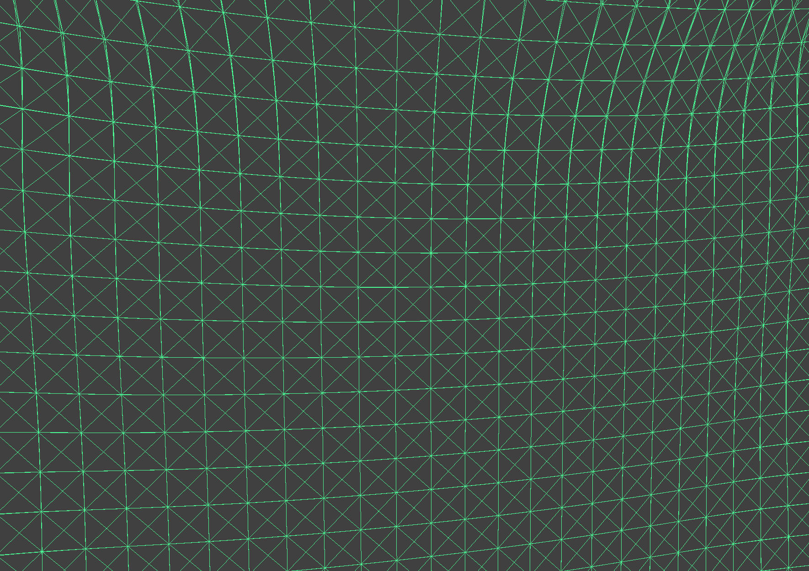
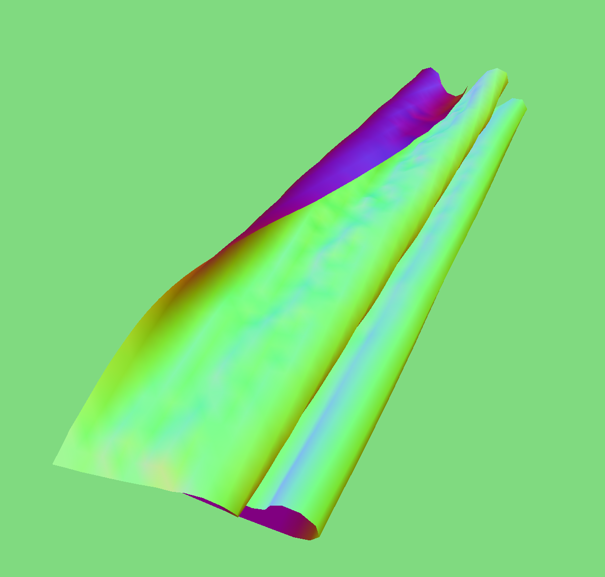

# Project 4: Cloth Sim

## Part 1: Masses and springs
**Take some screenshots of scene/pinned2.json from a viewing angle where you can clearly see the cloth wireframe to show the structure of your point masses and springs.**

Overall picture:
<!--  -->

Zoomed in picture:
<!--  -->

**Show us what the wireframe looks like (1) without any shearing constraints, (2) with only shearing constraints, and (3) with all constraints.**

* 	(1) Without any shearing
<!--  -->

*	(2) With only shearing constraints
<!--  -->

*	(3) With all constraints:
<!--  -->

# Part 2: Simulation via numerical integration
**Experiment with some the parameters in the simulation. To do so, pause the simulation at the start with `P`, modify the values of interest, and then resume by pressing `P` again. You can also restart the simulation at any time from the cloth's starting position by pressing `R`.**
* 	**Describe the effects of changing the spring constant ks; how does the cloth behave from start to rest with a very low ks? A high ks?**

The provided normal cloth has: `ks = 5000 N/m`, `density = 15 g/cm^2`, `damping = 0.200000%`

<!--  -->

Now, changing the parameters to see the individual effect of each on the cloth:

1. Low `ks = 10 N/m` has more sketchy cloth.
<!--  -->

2. High `ks = 100000 N/m` has less sketchy, in other words, stiffer cloth.
<!--  -->

3. Low `density = 5 g/cm^2` makes the cloth droops down less.
<!--  -->

4. High `density = 50 g/cm^2` makes the cloth droops down more.
<!--  -->

5. Low `damping = 1.000000 %` makes the cloth swap less.
<!--  -->

6. High `damping = 0.000000 %` makes the cloth swap MUCH more (like there is a storm or something high wind).
<!--  -->

*   **Show us a screenshot of your shaded cloth from scene/pinned4.json in its final resting state! If you choose to use different parameters than the default ones, please list them.**

Wire-framed pinned4.json:

<!--  -->

Normal shaded pinned4.json:

<!--  -->

## Part 3: Handling collisions with other objects
**Show us screenshots of your shaded cloth from scene/sphere.json in its final resting state on the sphere using the default `ks = 5000` as well as with `ks = 500` and `ks = 50000`. Describe the differences in the results.**

Default `ks = 5000` at final resting state (this is the basic "drapness" I will be comparing with other ks values):
<!--  -->

Cloth draped on sphere with `ks = 500` has much more parts of the cloth that **tightly hug** the sphere than that of the `ks = 5000`.
<!--  -->

Cloth draped on sphere with `ks = 50000` has much more parts of the cloth that **stiff out**/does not bend with the sphere than that of the `ks = 5000`.
<!--  -->

**Show us a screenshot of your shaded cloth lying peacefully at rest on the plane.**

My basic cloth lying peacefully on the ground plane:
<!--  -->

If viewing the above picture isn't easy enough to determine if it's right on the plane or not, this is the wire-framed image:
<!--  -->

## Part 4: Handling self-collisions

**Show us at least 3 screenshots that document how your cloth falls and folds on itself, starting with an early, initial self-collision and ending with the cloth at a more restful state (even if it is still slightly bouncy on the ground).**

Before cloth falls:
<!--  -->

Starting to fall. Cloth folds onto itself more at the bottom:
<!--  -->

Folds more onto itself and spread a bit on the ground as more cloth falls:
<!--  -->

Entire cloth fall on the ground. You can see that the wavy self-fold at the edge of the cloth:
<!--  -->

At resting state, the previous cloth slowly spread out more to cover the ground due to gravity: (rest state is still a bit wavy, but it is spread out more than with low density)
<!--  -->

At resting state. The other side of the cloth. Also see the self-fold.
<!--  -->

**Vary the density as well as ks and describe with words and screenshots how they affect the behavior of the cloth as it falls on itself.**

Low `density = 5`. The cloth is more folded onto itself and spreads out on the ground less:
<!--  -->

High `density = 500`. The cloth is less folded onto itself and spreads out on the ground more, as gravity pulls it down more due to its high density:
<!--  -->

Low `ks = 500`. The cloth has more rumpy, scuffle parts. It folds and creases over itself more.
<!--  -->

High `ks = 50000`. The cloth is MUCH smoother (like silk). It spreads out more and has less mini-folds/rumpy parts on the material.
<!--  -->

# Part 5: Shader
**Explain in your own words what is a shader program and how vertex and fragment shaders work together to create lighting and material effects.**
*   Shaders are separate programs running in parallel ini GPU. It executes sections of the graphics pipeline: takes in an input and outputs a 4 dimensional vector.
*   Vertex shader apply transforms to vertices, modifying their geometric properties (positions, normal vectors, etc.). The vertex shader's output is the input to fragment shader. (`gl_Position`)
*   Fragment shader takes in geometric properties of each fragments and output colors for that fragment `out_color`.

**Explain the Blinn-Phong shading model in your own words. Show a screenshot of your Blinn-Phong shader outputting only the ambient component, a screen shot only outputting the diffuse component, a screen shot only outputting the specular component, and one using the entire Blinn-Phong model.**

Only ambient component:
<!--  -->

Only diffuse component:
<!--  -->

Only specular component:
<!--  -->

All 3 components: ambient, diffuse, and specular
<!--  -->

**Show a screenshot of your texture mapping shader using your own custom texture by modifying the textures in /textures/**

Using this random texture pic I got on Google:
<!--  -->

I get this cloth and sphere image:
<!--  -->

**Show a screenshot of bump mapping on the cloth and on the sphere. Show a screenshot of displacement mapping on the sphere. Use the same texture for both renders. You can either provide your own texture or use one of the ones in the textures directory, BUT choose one that's not the default texture_2.png. Compare the two approaches and resulting renders in your own words. Compare how your the two shaders react to the sphere by changing the sphere mesh's coarseness by using -o 16 -a 16 and then -o 128 -a 128.**

The following methods use `-o 128 -a 128` and the dessert ground crack texture map that I used before:

Bump mapping cloth:
<!--  -->

Bump mapping sphere:
<!--  -->

Bump mapping cloth over sphere:
<!--  -->

**Show a screenshot of your mirror shader on the cloth and on the sphere.
Explain what you did in your custom shader, if you made one.**

Mirror shaded over just cloth:
<!--  -->

Mirror shaded over just sphere:
<!--  -->

Mirror shaded over clother draped over sphere:
<!--  -->

